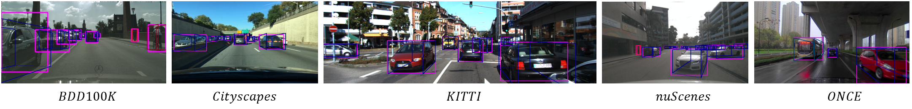

# Mono3D Detection

In contrast with [VisualDet3D], which contains Mono3D/Stereo3D/Depth Prediction (mainly trained in KITTI dataset). The Mono3D packages here focus on training models with **more datasets** (and trained with **ALL of these datasets**).



As shown in the image, we set up a pipeline to train **simultaneously** on **both 2D and 3D datasets** with varying label strategies and camera parameters.

## Dataset Settings

In this repo, we transform all datasets into a unified Json style. 

Check the [dataset page](../../mono3d/data/readme.md)

Besides, because we need to update object's info when we resize/crop the image, so we overwrite some of the data augmentation class.

## Get Started Training

1. Download **Any of** [KITTI object detection dataset](https://www.cvlibs.net/datasets/kitti/eval_object.php?obj_benchmark=3d), [nuScenes 850 scenes](https://www.nuscenes.org/nuscenes), [ONCE](https://once-for-auto-driving.github.io/), [CityScapes leftImages_trainval&gtBbox3d_trainval/gtBbox_cityPersons_trainval](https://www.cityscapes-dataset.com/downloads/), [bdd100k 100K Images/Detection 2020 Labels](https://doc.bdd100k.com/download.html). 

2. Run the corresponding jsonfify scripts in the vision_factory direction:

```
python3 mono3d jsonify_{XXX}.py # Please check each script for different usages 
```

3. Compute the mean_whl json for the dataset, which is the naive mean of WHL for each category across all jsonified 3D labeled data. You could compute it with the [scripts in demo](../../demos/check_json_dataset.ipynb) or simply download them from the release page. 

4. Then **check the configuration files for path to each jsonified dataset** you need to train/test on. 

5. Launch the standard training scripts as follow:

```
### multi-gpu training
./launcher/train.sh $CONFIG_PATH $COMMA_GPULIST $EXPERIMENT_LOGGING_NAME

### single-gpu training / debugging
python3 scripts/train.py $CONFIG_PATH $EXPERIMENT_LOGGING_NAME
```

**Training Notice:**

If we train five datasets from scratch with 100 epochs on four Nvidia-3090 GPUs, it could take about a week to finish. During our own test, the loss generally saturates in 80 epochs and validation result saturates at about 60 epochs.

Feel free to adjust the training schedule according to the dataset selection and the available machines.

## Testing 

[Evaluator Code](../../mono3d/evaluation/evaluators.py)

The current version only provides APIs for:

1. KittiObjEvaluateHook: Full KITTI 3D evaluation, and only can be done in KITTI dataset.
2. Object2DEvaluateHook: COCO 2D detection evaluation on any Jsonified dataset with 2D labels.
3. Object3DKittiMetricEvaluateHook: KITTI 3D evaluation **without masking unknown types nor allowing vans=Cars** (harder, not really reasonable, but generally available evaluator), which is a **general KITTI 3D metrics** on any Jsonified dataset with 3D labels. 

## ROS Streaming

We have update a script to launch ROS1 Node with visionFactory in [visualDet3D_ros](https://github.com/Owen-Liuyuxuan/visualDet3D_ros)

If you are using our provided pretrained model in kitti/nuscenes/once/cityscapes/bdd100k, it should produce reasonable results 


[VisualDet3D]:https://github.com/Owen-Liuyuxuan/visualDet3D