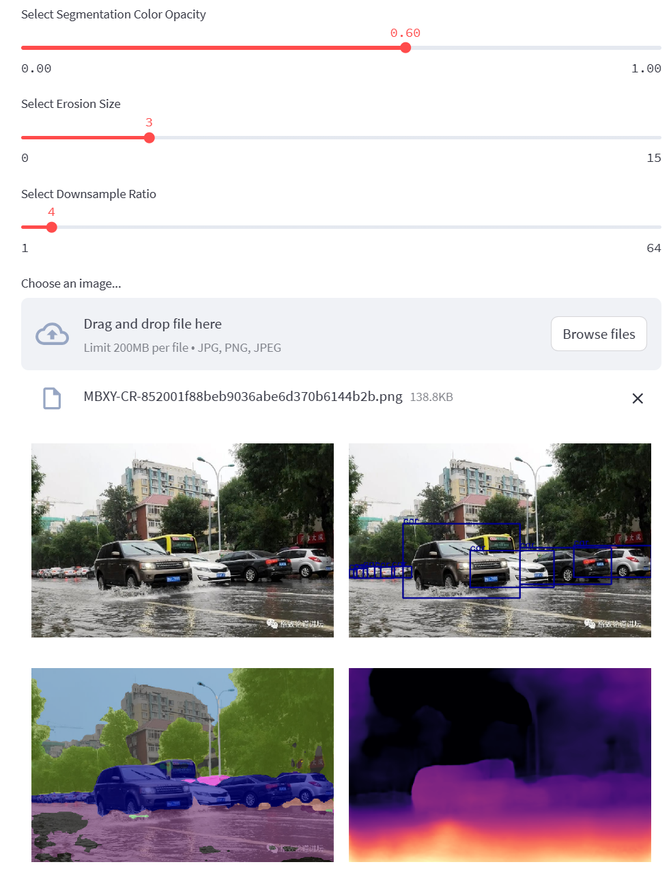
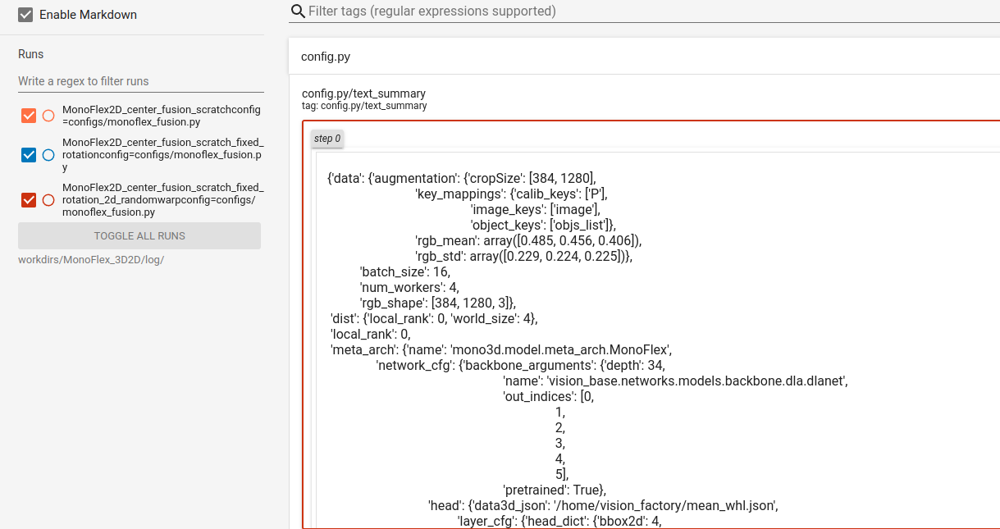
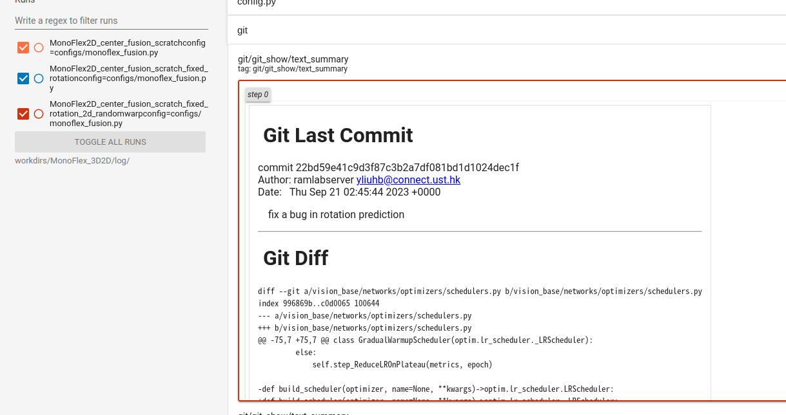

# Vision Factory

This is a general repo for training and testing vision tasks (monocular 3D detection, segmentation, monodepth and more). 


This repo contains the training/inference/export codes to obtain the three independent network models trained with completely different strategies (Notice: ROS Nodes and Dataset bridges are in other repos). Demonstration-Ready Models are in [release page](https://github.com/Owen-Liuyuxuan/visionfactory/releases/tag/v1.0).

The general starting points/runtime backbone will be in the "scripts", common modules, runtime plugins and helper functions will be in "vision_base". 

**For different tasks, we may meed to overwrite parts of the dataloader / model / evaluator. Checkout [mono3d], [segmentation], [monodepth] for their settings and module overview.**

**Notice For FSNet Users:** The training/testing scripts, vision_base and even the monodepth folder are basically the same as [FSNet](https://github.com/Owen-Liuyuxuan/FSNet). For monodepth tasks, for now it is completely fine to directly transferring configs/checkpoints across this two repos. We try to guarantee the backward compliance, especially in the scripts and vision_base package.

**Notice For VisualDet3d Users:** This repo mainly extracts the MonoFlex model from [visualDet3D](https://github.com/Owen-Liuyuxuan/visualDet3D). However after a complete redesign in the data section for more general usage and works in the new paper, we sadly determined not to follow the original design and merge with the [FSNet](https://github.com/Owen-Liuyuxuan/FSNet) standard.

In this main page, we will focus on the general usage of vision_base.

## (New) Launching Web Demo

We introduced ways to demonstrate the result of the pretrained ONNX models. (So that we could check results with any data at hand)

The onnxmodels are created with the export scripts. And we provide pretrained models in [release page of inference](https://github.com/Owen-Liuyuxuan/ros2_vision_inference/releases).

Install `streamlit` and run the following command from the base directory:
```
python3 -m streamlit run demos/web_demo.py --server.fileWatcherType none
```



We could upload any images and check the visualized results. If we do not indicate the camera parameters, the web-page will make a pseudo camera parameter for the demo usage.

The pretrained model is trained on road scenes so we could expect the potential and limitation of the models.

## Launching ROS Demo


## Pre-Use

We recommend torch > 1.10 or torch 2.0 with the corresponding CUDA versions. run 

```
./make.sh
```
This operation will build the dcn module inplace and does not install anything.

**Common Notice**: Make sure the nvcc version (```nvcc --version```) and the pytorch cuda version (```torch.version.cuda```) aligned.

## General Usage

Start **Everything** in the base directory of this repo. Please check out each tasks([mono3d]/[segmentation]/[monodepth]) for dataset preparation.

Training:

```
### multi-gpu training
./launcher/train.sh $CONFIG_PATH $COMMA_GPULIST $EXPERIMENT_LOGGING_NAME

### single-gpu training / debugging
python3 scripts/train.py $CONFIG_PATH $EXPERIMENT_LOGGING_NAME
```

Single testing:
```
python3 scripts/test.py $CONFIG_PATH $SINGLE_GPU $CHECKPOINT
```

## Check the Logging
 
By default, the train scripts and vision_base will create a detailed tensorflow report besides the logging from specific packages. The logging will be in ```./workdirs/\$NAME_IN_CONFIG/log/${EXPERIMENT_LOGGING_NAME}config=${CONFIG_NAME}```, we suggest tensorboard open in ```workdirs/$NAME_IN_CONFIG/log/``` or ```./workdirs/```.

The tensorboard report will include the **full expanded** config file 



and the git changes / git commits



with these info, it is easier to reproduce the experiments when we are tuning parameters in config or modifying codes.

## Tips for Developing

In general, we recommend not making breaking change in vision_base (adding more functionalities is generally fine, and extrely welcome for features/bugs report).

If we are starting a new project with new data settings / new models / new strategies, it is recommended to start a new folder and overwrite existing classes, and write config files pointing to new modules. This is achieved by [builder](./vision_base/utils/builder.py) and [find_object](./vision_base/utils/utils.py).

Check the codes in [segmenatation](./segmentation/) for how to start a simple new project.

Check the codes in [mono3d](./mono3d/) for how to overwrite data pipeline for complex tasks.

## Further Info and Bug Issues

1. Open issues on the repo if you meet troubles or find a bug or have some suggestions.
2. Directly Email to yliuhb@connect.ust.hk because the guy may not see email in the github-linked mailbox.

[mono3d]:docs/mono3d/readme.md
[segmentation]:docs/segmentation/readme.md
[monodepth]:docs/monodepth/readme.md